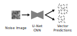

# Problem statement

Consider a simple procedural terrain generation algorithm.
This algorithm takes multiple 2D grids of 3D vectors as input, passes each grid through the [Perlin noise](https://en.wikipedia.org/wiki/Perlin_noise) algorithm, and superimposes those images into a single noise map.
This is a common way to generate fake terrain height-maps:

The goal of this investigation is to train a machine learning framework which reverses this process.
Given a terrain height-map image, predict the set of input vectors that produced it:

# Procedural Generation

The procedural terrain algorithm which will be used is a variation on Perlin noise.
Unlike standard Perlin noise, the generated terrain is spherical, representing an entire planetary surface.
This is achieved by combining 6 planar grids to form a cube, and then mapping that cube to a sphere.
In order to interpolate smoothly in this space, 3D vectors are used (even though the surface is 2D).
This approach avoids seams over the surface of the sphere, ensuring the terrain is continuous:

> Illustrations below will use an [equirectangular projection](https://en.wikipedia.org/wiki/Equirectangular_projection) instead.
> This is easier to illustrate than the 6 separate images.

# Neural Network structure

The network primarily uses a U-Net structure to convert height-map values into Perlin node values.
However, this is surrounded by some pre- and post-processing steps in order to manipulate the data into suitable forms.

## Pre-processing

Terrain images are passed to the network in the form of 6 faces forming a cube, rather than a single equirectangular projection.
There are two main reasons why this is preferred:

1. The "cube-faces" form matches the structure of the desired output (a cube of vector grids). As discussed above, this structure was chosen to avoid seams.
2. Each face can be processed independently and equivalently, as there should be no structural difference between them.
This is in contrast to equirectangular images, where each region of the image would be subject to drastically different warping.

For each layer of Perlin noise, it is noted that the value of a node vector is more closely linked to far-away pixels than to nearby pixels.
In fact, pixels at the nodal points of each layer will always be zero, providing no information at all.
When calculating the value of a vector, the most useful information should be near the center of the adjacent cells (which is to say at a distance of half the grid spacing along each axis).

With this in mind, additional channels are added to the input image: four channels for each Perlin layer, corresponding to the planet being rotated in such a way that one of the four nearby cell centers is aligned with the nodal point.
In this way, information about nearby cells is brought spatially closer to where it is needed (but in a different channel).
In addition, these extra channels allow the network to "peek" into nearby faces, as information beyond the face edges is shifted into view.
This should allow for better results near the face edges.

Since each face image should be independent, the "face" dimension is then flattened into the network's batch dimension.
In other words, each of the six images is fed into the network independently.

## Post-processing

The network is structured to output a grid of values of equal size to the input face, but with the number of channels equal to the number of desired Perlin layers times three.
Finally, each group of three channels is down-sampled (using an average-pooling layer) to match the number of grid vectors for that layer.
Hence, each of the three channels becomes one element of the output vectors for that layer.

Depending on the choice of loss function, these vectors can either be outputted as-is, or passed back into the procedural generation function to produce a final terrain image.

# Loss function

Two loss functions were attempted: Mean Squared Error between input and output image, and Mean Squared Error between target and output vectors.

It was found that MSE between target and output vectors was vastly more successful.
In addition to producing better results in fewer epochs, skipping the image generation step resulted in much lower training time per epoch.

# Results

The network achieves good results on unseen Perlin images, predicting vectors that produce very similar images to the target:

However, it remains unable to generalize to terrain that was not produced via this method.
Taking a [real height-map](https://visibleearth.nasa.gov/images/73934/topography) of the earth as input, the output image is very different:

> The discontinuities are due to predicted vectors not matching between cube faces.
> This could be fixed by simply taking the mean of vectors across edges.
> However, it shouldn't be needed for a network that produces good results (as shown by the previous images).

It is hypothesized that this is due to Perlin noise being insufficiently flexible to reproduce arbitrary terrain.
Although Perlin terrain is *seemingly* random, in actuality it is limited in the images it can produce.
It is conceivable that the space of possible Perlin images does not contain anything that approximates the earth's topography, in which case the above input image simply has no valid output vectors.

A modification was attempted in which each grid node was given a constant offset value, which is added to that node's value before final interpolation.
This should increase the space of possible images.
It improved results on the real image, but only marginally:

Here it seems likely that the network has learnt how to find a suitable constant offset value (which is somewhat trivial), but still fails to find good vectors.

In conclusion, it seems that the approach is successful in solving the original task of reversing layered Perlin noise, but that layered Perlin noise is not representative of real terrain height-maps.
Some modification to Perlin noise may solve this issue.
Another potential problem is the fact that real planetary height-maps are in very short supply, meaning there is insufficient real-world training data if procedural noise cannot be used.
